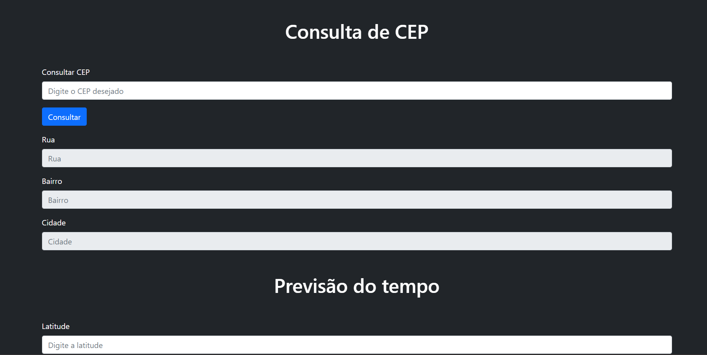

	

	<h1>Site para consulta de CEP e previsão do tempo</h1>

### O que é? 🤔
Site para consulta de CEP e previsão do tempo, utilizando API's grátis disponíveis na internet, o foco é colocar em prática dos métodos get, fetch, além de praticar um pouco de Bootstrap.

### Quais tecnologias foram usadas? 💻
- HTML5
- CSS3
- Javascript

### Está online? 📡
SIM! Basta [clicar aqui](https://cadastro-produtos-dnc.netlify.app/) para visualizar o site que está hospedado nos servidores da Netlify.

by Murillo Couto 
[GitHub](https://github.com/MurilloCouto)
